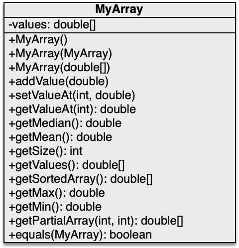

# OOP - WS 2023/24 - Exercise 04

## Object Oriented Programming - 2309 - Prof. Ronny Hartanto

 

---  

### Maximum number of "**commit/push**" for this exercise is **5**

> If you commit/push into the repository more than 5 times, you will not get any points for this exercise. 
> Initially, github will create your repository by filling it up with necessary contents. Therefore, you will start with x commits. The commit/push limitation is counted toward your commits, thus you should not exceed the x + 5 commits in total to receive the points for this exercise. 

--- 

## Assignments

1. Implement **MyArray** class as depicted in the UML-Diagram below to store double values in array. Create your own file inside the **src/main/java**. Make sure the class meets the following conditions / behaviours:   
* The class has three constructors:
  * Default constructor: will create an empty array.
  * Copy constructor: will accept a MyArray object as it's argument.
  * Constructor with array of double as argument.
* The method *addValue(double)* will append the double value in the argument into the *values* array.
* The method *setValueAt(int, double)* will replace the value pointed by the first argument with the value from the second argument. Like in C programming, in Java the array index start from 0. This method does nothing if the target index is invalid, i.e., doesn't have any value stored at the location.
* The method *getValueAt(int)* will return the value at the location pointed by the argument. This method return -1 if the index is invalid. 
* The method *getMedian()* will return the median of the array.
* The method *getMean()* will return the mean of the array.
* The method *getSize()* will return the number of elements of the array.
* The method *getValues()* is the getter method for *values*. This method return an identical copy of the values. 
* The method *getSortedArray()* will return a sorted array of the values. Calling this method will not change the orignal order of the *values* attribute.
* The method *getMax()* will return the largest number stored in the array.
* The method *getMin()* will return the smallest number stored in the array. 
* The method *getPartialArray(int, int)* will return a subset of the array indexed by the start and end from the arguments. This method returns empty array upon invalid arguments.
* The method *equals(MyArray)* will return true if the object in the argument has the same values in the same order stored in the *values* attribute. 

 

2. In an n-sided regular polygon, all sides have the same length and all angles have the same degree (i.e., the polygon is both equilateral and equiangular). Design a class named **RegularPolygon** that contains:  
* A private *int* data field named *n* that defines the number of sides in the polygon with default value 3.
* A private *double* data field named *side* that stores the length of the side with default value 1.
* A private *double* data field named *x* that defines the x-coordinate of the polygon’s center with default value 0.
* A private *double* data field named *y* that defines the y-coordinate of the polygon’s center with default value 0.
* A no-arg constructor that creates a regular polygon with default values.
* A constructor that creates a regular polygon with the specified number of sides and length of side, centered at (0, 0), in that order. If the user call the method using invalid argument, the default value will be used instead. (Hint: the constructor has two arguments only)
* A constructor that creates a regular polygon with the specified number of sides, length of side, and x- and y-coordinates, in that order. It the user call the constructor with invalid values for sides or length, it will create an object using default value for invalid argument but the x- and y-coordinates arguments from the user will always be used. (Hint: minimum value for side is 3).  
* The accessor and mutator methods for all data fields.
* The method *getPerimeter()* that returns the perimeter of the polygon.
* The method *getArea()* that returns the area of the polygon. The formula for computing the area of a regular polygon is  

* The method *toString()* that returns the coordinates of the polygon's points. The first segment of the polygon is always aligned with x+ axis of a cartesian coordinate. The coordinates are separated with comma without any space in between. The values of the coordinates always in form of two digits decimal value. For example, a polygon which has four sides with length of 1 with origin (0,0) will return: *(0.00,0.00),(1.00,0.00),(1.00,1.00),(0.00,1.00)*.   
  Draw the UML diagram for the class then implement the class. Create your own file inside the **src/main/java**. Upload the UML diagram in the UML folder. 
---

## Instruction
You have to work on your local machine to do this exercise. Don't use the WebIDE as it will use up your "commit/push" tokens. 

**Please follow the following steps:**
1. Clone the repository into your local computer. (you can use terminal or any Git client)
2. Open the local repository on your local computer using your favourite editor (text editor or IDE)
3. Work on your assigment solve all the given problem, make sure they run on your computer. **Don't change the structure of the directory**
4. If you completed all the assigments, *commit* your change to Git and *push* it to the Github (using your GitClient or terminal)
5. Check your submission by visiting your Github repository, after a while you should be able to see the result (:white_check_mark: or :x:)
6. If you have :white_check_mark: then you are done with your exercise, otherwise repeat step 3 onward. 

--- 

## Important

You can ONLY change files inside the **src/main/java** folder and place your name in this readme file. Depending on your task, you might need to create a new class in the **src/main/java** folder. Please don't make any modification anywhere else. 

**Make sure you submit your exercise before the deadline.** 
> If you submit after the deadline, it will not be graded

---
## Notes
* **WS2023/24** The points are not part of the final assessment. This purely exercise to help you learn Java programming.
* The submission will be evaluated automatically (most of the case)!
* If it doesn't compile, it could be some mistakes on your submission. (no points will be awarded in this case)
* You will receive the points upon successful solving the tasks. 
* You can make or modify your submission before the deadline
* Make sure you don't exceed the limit, sometime it's better to get partial points than exceeding the limit. 
* Use this exercise to practice your programming skill
